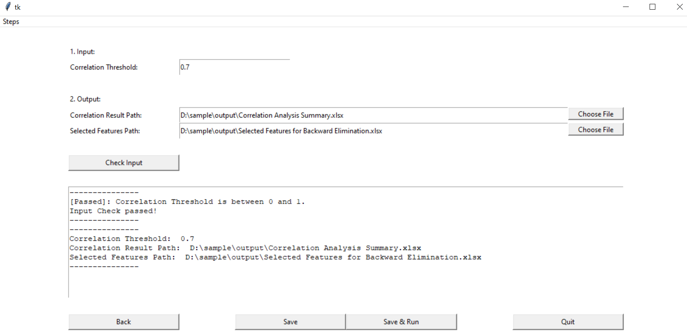

# Credit_Modelling---Desktop-App

## 1. Introduction ##
This app illustrates multivariate-analysis steps in **PD (Probability Default) model**, which includes:

* Step 1: Technically adjust original WoE of special bins based on defined rules
* Step 2: Update revised WoE values for all features in both train and test dataset
* Step 3: Remove highly correlated features on given threshold
* Step 4: Backward features elimination
* Step 5: Run scenarios combinations
* Step 6: Bootstrapping validation

## 2. How to use ##
### 2.1 GUI ###
* GUI framework: Tkinter  
To navigate to specific steps, you can select options in menu **Steps** or click on buttons displayed.

>*(!) Option **Single Factor Analysis** has not been developed yet!*

### 2.2 Model Configuration ###
* **Step 1: Technically adjust original WoE of special bins based on defined rules**  
After transforming orginal features' values to WoE, further technical process can be performed to adjust WoE for special values such as missing, infinity, ...

* Input:
> 1. Single Factor Initial Binning.xlsx
> 2. Selected Variables.xlsx

* Output: 
> 1. Adjusted WoE on Bins.xlsx

* **Step 2: Update revised WoE values for all features in both train and test dataset**  
Update adjusted WoE to original train and test dataset for each feature. 

* Input:
> 1. Raw Data Train Set.csv
> 2. Raw Data Test Set.csv

* Output: 
> 1. Adjusted WoE Train Set.xlsx
> 2. Adjusted WoE Test Set.xlsx

* **Step 3: Remove highly correlated features on given threshold**  
Pick a correlation threshold to find set of features having pair correlation less than.

* Input:
> 1. Correlation Threshold

* Output: 
> 1. Correlation Analysis Summary.xlsx
> 2. Selected Features for Backward Elimination.xlsx

* **Step 4: Backward features elimination**  
Run Logistic Regression for features selected in Step 3. Remove feature having highest P-value then re-run Logistic Regression for remaining features. The procedures are performed till there is no feature have p-value higher than given threshold.

After that, similar algorithm is applied to remove features, which violate with VIF and Beta (Coefficient) threshold (e.g. coefficients should be negative)

* Input:
> 1. P-value Threshold
> 2. VIF Threshold
> 3. Beta Threshold

* Output:
> 1. Selected Features for Scenarios Combinations.xlsx

* **Step 5: Run scenarios combinations**  
Based on expert judgement, the number of features in final models should be determined in range of minimum and maximum number of features (this also depends on computation cost).  
 
All possible combinations of features are performed and only combinations pass P-value, VIF and Beta test will be exported for expert evaluation to choose final model.

* Input:
> 1. Min Features Number
> 2. Max Features Number
> 3. P-value Threshold
> 4. VIF Threshold
> 5. Beta Threshold

* Output: 
> 1. Model Performance.txt
> 2. Model Coefficient.txt

* **Step 6: Bootstrapping validation**  
Due to unbalanced default/non-default ratio in PD model, bootstrapping validation should be considered investigate model performance stability.

* Input:
> 1. Test Sampling %
> 2. Number of Iterations

* Output: 
> 1. Bootstrapping Performance.xlsx

### 2.3 Execute Steps ###
Click on **Save & Run** button in every page to navigate **Run** section.
Here you can choose any group of steps to run. As you click on a step, the app will check if all input are filled completely.
Finally, click **Run** button and wait till the app announces completion.

### 3. Further Work ###
* Complete Single Factor Analysis part
* Apply other models than Logistic Regression
* Deploy on Web App
* Add features to help users grain more control of training model process without leaving from app
* ...